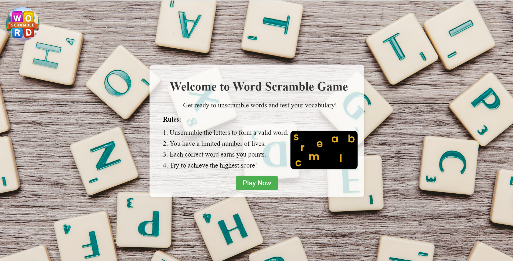
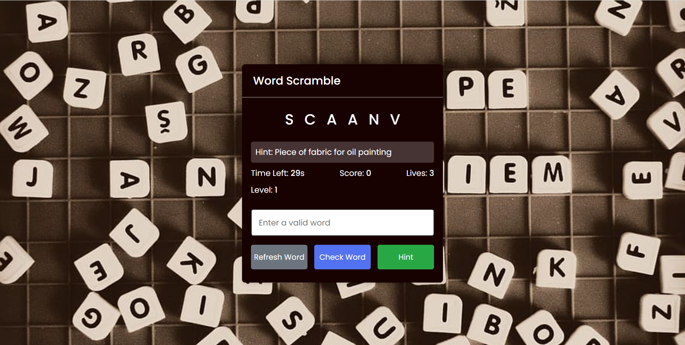
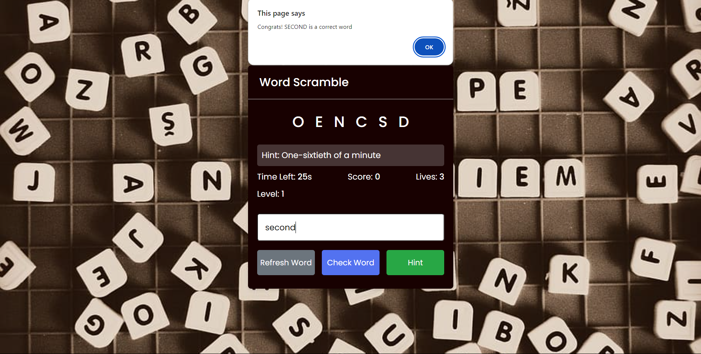
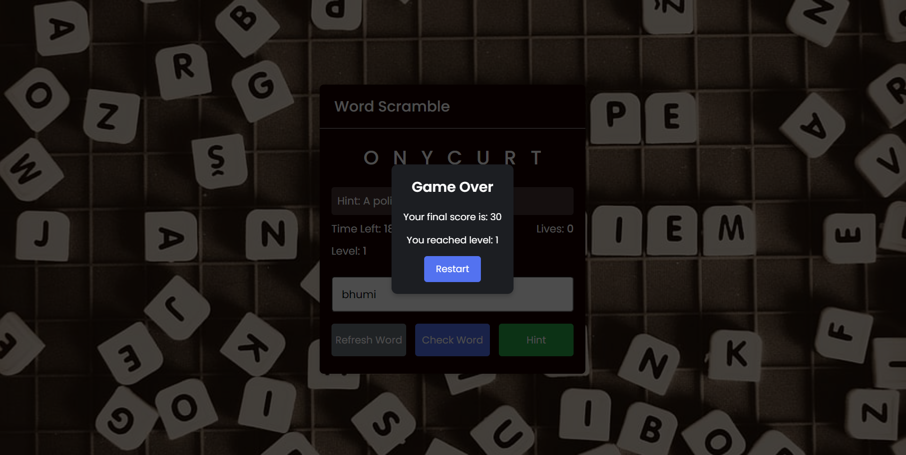

# **Word Scramble Game**

## Table of Contents
- [Description](#description)
- [Functionalities](#functionalities)
- [How to Play](#how-to-play)
- [Screenshots](#screenshots)
- [Author](#author)
- [Contributing](#contributing)
- [License](#license)

## Description

Welcome to the Simple Word Scramble Game! It's straightforward yet addictively fun. Just unscramble the letters to reveal the hidden words. With each correct answer, you'll feel a rush of satisfaction as you unlock new levels. Perfect for quick bursts of entertainment or a relaxing challenge anytime, anywhere. The game aims to challenge players' vocabulary and word unscrambling skills while providing an engaging and interactive experience. Dive in and test your word skills with this easy-to-play game!

## Functionalities

The game consists of the following functionalities:

1. Upon loading the page, players are welcomed with a screen providing information about the game. Clicking the "Play Now" button redirects the player to the game page.
2. Players must rearrange the scrambled letters within a given time interval to form a valid word.
3. For every correct word, the player earns 10 points.
4. If the word entered by the player is incorrect, they lose a life. The game ends if the player loses all their lives.
5. The player can use the "Hint" button to reveal a hint for the current word, but this can only be used once per game.
6. The game progresses through levels, with each level presenting increasingly difficult words. The time limit for each word decreases as the level increases.
7. This is a single-player game.

## How to Play? 

1. Upon visiting the website, you'll be greeted with a welcome screen.
2. By clicking "Play Now," you'll be redirected to the game page.
3. You'll see a scrambled word and a hint. Rearrange the letters to form a valid word and click the "Check Word" button or use the "Enter" key to submit your answer.
4. For every correct answer, you earn points. For incorrect answers, lives are deducted.
5. The game continues until all lives are finished.
6. After completing, you'll receive your final score and the level cleared. Your score is based on the number of correct answers.

## Screenshots

### Home Page

### Game Page

### For Correct Answer

### For Wrong Answer

### Game Over

## Author

**Bhumika Bhatt**

## Contributing

Feel free to contribute by submitting issues or pull requests. If you have any suggestions or improvements, let us know!

## License

This project is licensed under the MIT License - see the [LICENSE]((https://opensource.org/licenses/MIT)) file for details.

---

Enjoy the game and good luck unscrambling the words! 🎉
